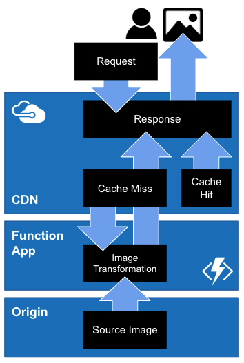

# ImageFLY: On-the-fly image transformations

An [Azure Function App](https://docs.microsoft.com/en-us/azure/azure-functions/) using [TypeScript](https://www.typescriptlang.org/) for on-the-fly image transformations. View the [blog post](https://dholmes.co.uk/imagefly-on-the-fly-image-transformations) for more information.


> ^ Thanks [DALL·E](https://labs.openai.com/) for the "High quality photo of a fly riding a space rocket"

This repo can be found at the following remotes:

1. [GitHub: desholmes/imagefly](https://github.com/desholmes/imagefly)
2. [Azure DevOps: DesHolmes/_git/imagefly](https://dev.azure.com/codecupltd/DesHolmes/_git/imagefly)

The example function app uses `https://dholmes.co.uk/img/` as the `ORIGIN`:

1. Original Image: [dholmes.co.uk/img/docker-tagging.png](https://dholmes.co.uk/img/docker-tagging.png) (PNG, 453kb, ~51ms)
2. ImageFly webp (defaults): [imagefly.dholmes.co.uk/docker-tagging.png](https://imagefly.dholmes.co.uk/docker-tagging.png) (58kb, ~38ms)
3. ImageFly jpeg (format:jpeg, quality:30): [imagefly.dholmes.co.uk/docker-tagging.png?format=jpeg&quality=30](https://imagefly.dholmes.co.uk/docker-tagging.png?format=jpeg&quality=30) (48kb, ~35ms)

> Note: The example response times provided are based on a warmed up cache, initial response times will be slower.

See the full list of supported query params in the Usage section below.

## System Overview

It's recommended to use ImageFLY with an [Azure CDN](https://azure.microsoft.com/en-gb/services/cdn/) to reduce the number of requests to the function app, and improve performance.



## Usage

### GET: /api/v1/image/{imagePath}

* Transforms and image based on the `ORIGIN` environment variable and the `imagePath` route parameter
* Query Params:
  * `format`: `string`: The format of the image; Supports: `jpeg`, `png`, `webp` (Default: `webp`)
  * `quality`: `number`: The quality of the image, Supports: `0-100` (Defaults: `50`)

**Returns:** A transformed image, or a 404 if the image is not found.

> Example: Returns format: webp, quality:30: [imagefly.dholmes.co.uk/docker-tagging.png?format=webp&quality=30](https://imagefly.dholmes.co.uk/docker-tagging.png?format=webp&quality=30)

### GET: /api/v1/health-check

* Health check route
* **Request URL** GET: `/api/v1/health-check`

Used by monitoring to check system health.

**Example response**:

```json
{
  "error": false,
  "message": "Service is available"
}
```

---

## Development

### Prerequisites

1. An installation of [Node.js v18.12.1 (npm v8.19.2)](https://nodejs.org/en/download/)
2. An installation of [Azure Functions Core Tools v4](https://www.npmjs.com/package/azure-functions-core-tools)
3. An installation of [VSCode](https://code.visualstudio.com/download) with the following extensions:
   1. [Spelling Checker](https://marketplace.visualstudio.com/items?itemName=streetsidesoftware.code-spell-checker)
   2. [ESLint](https://marketplace.visualstudio.com/items?itemName=dbaeumer.vscode-eslint)
   3. [Prettier](https://marketplace.visualstudio.com/items?itemName=esbenp.prettier-vscode)
4. A working knowledge of:
   1. [Azure Functions](https://docs.microsoft.com/en-us/azure/azure-functions/functions-get-started?pivots=programming-language-csharp) (and the [VsCode extension](https://marketplace.visualstudio.com/items?itemName=ms-azuretools.vscode-azurefunctions) is installed)
   2. [Node.js](https://nodejs.org/en/)
   3. [TypeScript](https://www.typescriptlang.org/)

### Getting Started

1. Review and complete the `Prerequisites` above
2. Copy [./local.settings-template.json](./local.settings-template.json) to `./local.settings.json` and replace the required environment variables
3. `npm i`: Install dependencies
4. `npm run start:dev`: Start the local DEV environment
5. Press `CTRL+c` to stop the local DEV environment

### Environment Variables

| Name| Description|
| --- | --- |
| `LIMITER_TOKENS` | `number`: *Optional* - The number of tokens to allow per `LIMITER_INTERVAL` (Default: `150`) |
| `LIMITER_INTERVAL` | `string`: *Optional* - The interval (Default: `hour`) |
| `ORIGIN` | `string`: **Required** - The origin of the image source. |
| `AzureWebJobs.v1HeathCheck.Disabled` | `boolean`: *Optional* - To disable the `v1HeathCheck` function  |
| `AzureWebJobs.v1Image.Disabled` | `boolean`: *Optional* - To disable the `v1Image` function |

## Commands

|Command|Description|
|---|---|
|`npm start`|Starts the Function App in Azure `func start`|
|`npm start:dev`|Starts a local dev environment by running `npm start` and `npm run watch` concurrently|
|`npm run build`|Create a build `tsc`|
|`npm run watch`|Watch and create a build `tsc tsc -w`|
|`npm run audit`|Runs `npm audit --production --audit-level=critical` to check for known vulnerabilities|
|`npm run lint`|Run eslint `eslint --max-warnings=0 --ext=ts,json ./`|
|`npm run lint:fix`|Run eslint with fix arg `eslint --max-warnings=0 --fix --ext=ts,json ./`|

## Credits

* [Des Holmes: Technical Leadership & Product Development](https://dholmes.co.uk)
  * [About](https://dholmes.co.uk/) [Blog](https://dholmes.co.uk/blog)
  * **Skills & knowledge**: [Technical Leadership](/tags/technical-leadership), [Technical Direction](/tags/technical-direction), [Technical Delivery](/tags/technical-delivery), [Product Development](/tags/product-development), [SaaS](/tags/saas), [DevOps](/tags/devops), [Azure Public Cloud](/skills)
  * **Job Titles**: [CTO](/tags/cto), [VP Engineering](/tags/vp-engineering), [Head of DevOps](/tags/devops), [Technical Product Owner](/tags/technical-product-owner)
  * **Example Projects**: [Development standards](/tags/code-quality), [DevOps](/tags/devops), [CI/CD](/tags/ci-cd), [React](/tags/react), [docker](/tags/docker), [Cost Management](/tags/costs)
  * **Contact**: [LinkedIn](https://www.linkedin.com/in/desholmes/) [Twitter](https://twitter.com/whodadada)
* [sharp](https://sharp.pixelplumbing.com/): Fast image transformation library
* [limiter](https://www.npmjs.com/package/limiter): Rate limiter
* [ChatGPT](https://openai.com/blog/chatgpt): For the moral support
* [GitHub Copilot](https://github.com/features/copilot): For populating the boring stuff
